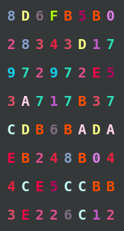

# sha256-img

A python 3 script which sha-256 a string and then outputs the result as an image.

# Installation

> pip install -r requirements.txt

# Usage

> $ python sha256-img.py "i love peanut butter"

The following image is output:

> $ echo -n "i love peanut butter" | sha256sum  
> 8d6fb5b028343d17972972e53a717b37cdb6badaeb248b044ce5ccbb3e226c12

# Dependencies

- [Pillow](https://python-pillow.org/)

# License

See the [LICENSE](LICENSE.md) file for license rights and limitations (MIT).
